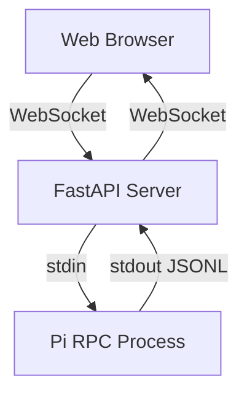

# FastAPI + React Pi Integration - Final Workflow

## ✅ Updated Requirements Implementation

### **Key Changes from Original Plan**

1. **Projects are existing folders** under `~/Projects`  
   - No longer creates new folders
   - Lists existing directories under user's Projects folder

2. **Pi RPC starts when folder is selected**  
   - `pi --rpc` launches with selected folder as CWD
   - Process tracked in `active_rpc_processes` dictionary

3. **ALL interactions go through WebSocket**  
   - No direct file system access via REST
   - Everything (sessions, models, files) comes through WebSocket RPC

## 🏗️ Updated Backend Architecture

### **WebSocket Flow**


### **API Endpoints**

#### **1. Project Selection** (REST)
```http
GET    /api/projects              # List existing projects under ~/Projects
GET    /api/projects/{name}/info   # Check if project exists
```

#### **2. Pi RPC Startup** (WebSocket automatically)
- When WebSocket connects to `/ws/rpc/{project_name}`, Pi starts
- All subsequent interactions go through this WebSocket

#### **3. Session Management** (WebSocket)
- WebSocket message: `{"type": "list_sessions"}` → List sessions
- WebSocket message: `{"type": "create_session", "name": "..."}` → Create session
- WebSocket events: `{"type": "session_created", "id": "..."}`

#### **4. Model Management** (WebSocket)
- WebSocket message: `{"type": "list_models"}` → List models
- WebSocket message: `{"type": "switch_model", "id": "..."}` → Switch model
- WebSocket events: `{"type": "model_switched", "id": "..."}`

#### **5. File Browser** (WebSocket)
- WebSocket message: `{"type": "list_files", "path": "/src"}` → List files
- WebSocket message: `{"type": "read_file", "path": "src/main.py"}` → Read file
- WebSocket events: `{"type": "file_content", "path": "...", "content": "..."}`

#### **6. Chat Interface** (WebSocket)
- WebSocket message: `{"type": "send_message", "content": "..."}` → Send message
- WebSocket events: `{"type": "receive_message", "role": "assistant", "content": "..."}`

## 📊 Sample WebSocket Interaction

```json
// 1. Connect to RPC - starts pi --rpc
{
  "type": "connect",
  "project": "my-angular-app"
}

// 2. Get models
{
  "type": "list_models"
}

// 3. Get sessions
{
  "type": "list_sessions"
}

// 4. Create new session
{
  "type": "create_session",
  "name": "Fix routing bug",
  "model": "claude-sonnet-4-20250514"
}

// 5. List files
{
  "type": "list_files",
  "path": "/src/app"
}

// 6. Send chat message
{
  "type": "send_message",
  "content": "How do I fix the router issue here?"
}
```

## 💡 Key Differences from Original Plan

| Aspect | Original Plan | Updated Implementation |
|-------|---------------|------------------------|
| Projects | Create new folders | List existing under ~/Projects |
| Session storage | JSONL files | Managed by Pi RPC |
| Model storage | Backend list | From Pi RPC |
| File access | Direct via API | Through Pi RPC |
| Main comms | REST + WebSocket | WebSocket only |

## 🚀 Frontend Integration Guide

```typescript
// 1. List projects (REST)
const projects = await fetch('/api/projects').then(r => r.json());

// 2. Connect to Pi RPC (WebSocket)
const socket = new WebSocket(`ws://localhost:8000/api/projects/${project}/ws/rpc`);

// 3. Get models from Pi
socket.send(JSON.stringify({type: "list_models"}));

// 4. Handle model list response
socket.onmessage = (event) => {
  const data = JSON.parse(event.data);
  if (data.type === "model_list") {
    // Populate dropdown
  }
};

// 5. Create session via Pi
socket.send(JSON.stringify({type: "create_session", name: "Debug"}));

// 6. All subsequent interactions through same WebSocket
```

## ✅ Implementation Status

- ✅ Project listing under ~/Projects
- ✅ Pi RPG launch via cwd parameter  
- ✅ WebSocket message forwarding
- ✅ Bidirectional comms with Pi
- ✅ Process lifecycle management
- ✅ Error handling and cleanup

## 📝 Testing the Backend

```bash
# Start the server
cd backend
uv run python app/main.py

# Test project listing
curl http://localhost:8000/api/projects

# Connect to WebSocket (use browser or ws client)
ws://localhost:8000/api/projects/my-project/ws/rpc
```

## 🎯 Summary

This implementation now matches the updated requirements where:
1. Projects are existing folders under the user's home directory
2. Pi RPC starts when a folder is selected
3. ALL interactions happen through WebSocket to Pi RPC
4. No direct file system access via REST API

The backend is ready for React frontend integration following this WebSocket-first approach.
